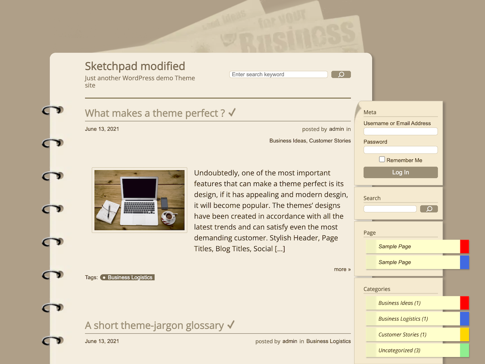

# sketchpad-modified

 

This is a modified theme of Sketchpad from BestLayout.com. Original is [it](https://bestweblayout.com/products/sketchpad/).

Original Sketchpad theme has stopped updating. (Last Update V2.0 – 25.08.2016)

I like this theme so I dicided to customize it. Not a job but a hobby...

## Changes from the original
### Responsive Support

Smartphone screens are now supported.

The sidebar can displayed via the hamburger menu.

### Design

I changed the size of the text and eye catching image to make them easier to read, and added post-it and other designs to make it more notepad-like.

### Feature

The following features have been added.

 - Breadcrumb
 - Return to Top Button
 - Hamburger Menu
 - Output more read links to RSS feeds when you select excerpt
 - Output Eye catching image to RSS feeds
 - Setting up a Blog Card
 - HTML can be inserted into the Head tags
 - HTML can be inserted into the Body tags
 - Infinite Scroll (JetPack Plugin)

### Repeal

The following features have been removed.

 - IE Support

## Requirement

The following libraries are required for this theme.

 - [Font Awesome 5 Free](https://fontawesome.com/)
